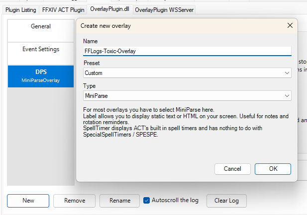
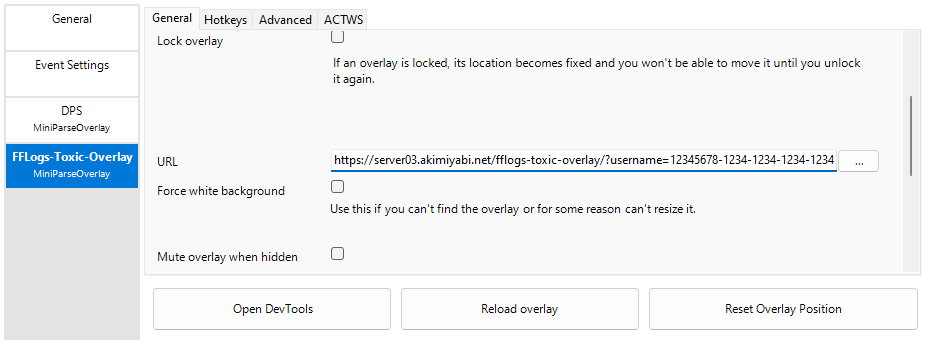
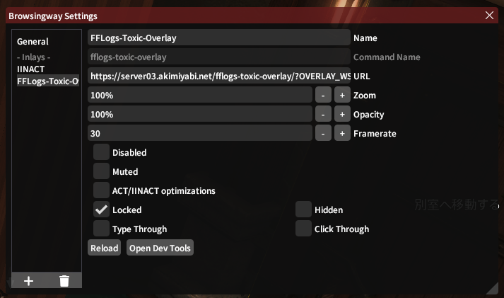
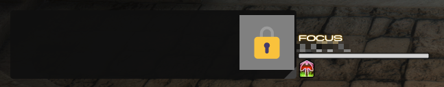
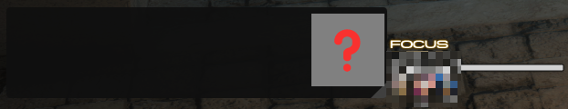

<!-- PROJECT LOGO -->
<br />
<div align="center">
    <a href="https://github.com/callieniera/fflogs-toxic-overlay/">
        <h1> FFLogs-Toxic-Overlay</h1>
    </a>
    <p align="center">
        とてもトキシックなACT用オーバーレイです
    </p>
</div>

<ol>
    <li>
        <a href="#マニュアル">マニュアル</a>
        <ul>
            <li><a href="#事前準備">事前準備</a></li>
            <li><a href="#act導入">ACT導入</a></li>
            <li><a href="#iinact導入">IINACT導入</a></li>
        </ul>
    </li>
    <li><a href="#使い方">使い方</a></li>
    <li><a href="#エラー解消">エラー解消</a></li>
    <li><a href="#ご注意">ご注意</a></li>
    <li><a href="#関連リンク">関連リンク</a></li>
    <li><a href="#変更履歴">変更履歴</a></li>
    <li><a href="#開発者">開発者</a></li>
</ol>

## マニュアル

### 事前準備

1. [FFLogsクライアント管理ページ](https://ja.fflogs.com/api/clients/)で新しいクライアントを作成。
    - アプリケーションの名前: `fflogs-toxic-overlay(適当で大丈夫)`
    - Enter one or more redirect URLs: `http://127.0.0.1`
2. `client ID`と`client secret`はあとで使うので一旦コピーし、保存してください。
    - `client secret`はあとで確認することができないので、紛失した場合は再発行となります。


### ACT導入
ACTに導入したい場合、`OverlayPlugin.dll`が必要になります。

[OverlayPlugin](https://github.com/OverlayPlugin/OverlayPlugin/releases) (0.19.18+)

1. URLはこちら：
    ```
    https://server03.akimiyabi.net/fflogs-toxic-overlay/
    ```
2. `client ID` `client secret`をパラメータ`username` `password`としてURLの後ろに追加：
    ```
    ?username=client ID&password=client secret
    ```
    パラメータを追加したURLはこんな感じになります：
    ```
    https://server03.akimiyabi.net/fflogs-toxic-overlay/?username=12345678-1234-1234-1234-123456789123&password=abcdefghijklmnopqrstuvwxyz
    ```
3. ACT`Plugins` > `OverlayPlugin.dll`タブに下の画像のように新しいオーバーレイを追加。
    > Preset: `Custom`  
    > Type: `MiniParse`  
    >   
4. 新しく追加されたオーバーレイの`General`タブにあるURL欄に、URLを貼る。  
    >   

5. `Reload overlay`

### IINACT導入
IINACTに導入したい場合、Browsingwayが必要になります。

 - [IINACT](https://www.iinact.com/) ([Github](https://github.com/marzent/IINACT))
 - Browsingway ([Github](https://github.com/Styr1x/Browsingway)) 

1. URLはこちら：
    ```
    https://server03.akimiyabi.net/fflogs-toxic-overlay/?OVERLAY_WS=ws://127.0.0.1:10501/ws
    ```
2. `client ID` `client secret`をパラメータ`username` `password`としてURLの後ろに追加：
    ```
    &username=client ID&password=client secret
    ```
    パラメータを追加したURLはこんな感じになります：
    ```
    https://server03.akimiyabi.net/fflogs-toxic-overlay/?OVERLAY_WS=ws://127.0.0.1:10501/ws&username=12345678-1234-1234-1234-123456789123&password=abcdefghijklmnopqrstuvwxyz
    ``` 
3. Browsingwayに新しいオーバーレイを追加、パラメーターがあるURLを貼る。  
    >   
4. `Reload`

## 使い方
ゲーム内でキャラクターを4~5秒フォーカスしたら、オーバーレイに相手のデータを表示させることができます。

 > 

オーバーレイはマウスホイールで左右操作することができます。

おすすめ設定：

 > サイズ：`Height` `100px` 以上  
 > 位置：ゲーム画面の右  
 > ロック：`✔`  
 > クリックスルー：`❌`

 > 非表示のキャラクター  
 > 


 > FFLogsにデータのないキャラクター  
 > 

## エラー解消

1. **認証できません**   
    `client id (Username)`か`client secret (password)`が正しくありません。  
      
2. **未対応ワールド**  
    現在 (`v0.1.0`)、日本サーバーにあるワールドのみ対応可能です。  
      
3. **リクエストが多すぎます**  
    しばらくお待ちください。  
      
4. 他のエラー  
    連続で発生する場合、ぜひ[issue](https://github.com/callieniera/fflogs-toxic-overlay/issues)で報告お願いします。  
      
## ご注意
FFLogs APIに問い合わせるために、`client id`および`client secret`をサーバーに送ることになります。URLに`username` `password`のない状態でも、オーバーレイを利用できますが、一定時間内に問い合わせる回数の制限がございます。

**ACTやIINACTなど外部ツールに該当るすもののご使用は自己判断、自己責任でお願いします。**

## 関連リンク

 - [XIVLauncher](https://goatcorp.github.io/)  
 - [FFLogsViewer](https://github.com/Aireil/FFLogsViewer)  
 - [IINACT](https://www.iinact.com/)  
 - [Advanced Combat Tracker](https://advancedcombattracker.com/)
 - [OverlayPlugin](https://github.com/OverlayPlugin/OverlayPlugin/)


## 変更履歴
 > ``` 
 > v0.1.0 Public Version  
 > v0.0.0 Insider Test Verion  
 > ```


## 開発者

[Twitter@kagami_transl](https://twitter.com/kagami_transl)

Discord: `Kagami Akimiyabi#0127`