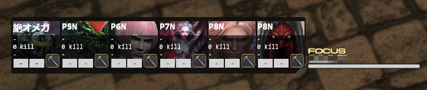

<!-- PROJECT LOGO -->
<br />
<div align="center">
<a href="https://github.com/callieniera/fflogs-toxic-overlay/">
<h1> FFLogs-Toxic-Overlay</h1>
</a>


  <p align="center">
    とてもトキシックなACT用オーバーレイです
  </p>
</div>

  <ol>
    <li>
      <a href="#%E4%BA%8B%E5%89%8D%E6%BA%96%E5%82%99">マニュアル</a>
      <ul>
        <li><a href="#built-with">事前準備</a></li>
        <li><a href="#iinact%E5%B0%8E%E5%85%A5">IINACT導入</a></li>
        <li><a href="#act%E5%B0%8E%E5%85%A5">ACT導入</a></li>
      </ul>
    </li>
    <li><a href="#%E4%BD%BF%E3%81%84%E6%96%B9">使い方</a></li>
    <li><a href="#エラー解消">エラー解消</a></li>
    <li><a href="#%E3%81%94%E6%B3%A8%E6%84%8F">ご注意</a></li>
    <li><a href="#change-log">Change Log</a></li>
    <li><a href="#%E9%80%A3%E7%B5%A1%E5%85%88">連絡先</a></li>
  </ol>

## マニュアル

### 事前準備

1. [FFLogsクライアント管理ページ](https://ja.fflogs.com/api/clients/)で新しいクライアントを作成。
    - アプリケーションの名前: `fflogs-toxic-overlay(適当で大丈夫)`
    - Enter one or more redirect URLs: `http://127.0.0.1`
2. `client ID`と`client secret`はあとで使うので一旦コピーし、保存してください。
    - `client secret`はあとで確認することができないので、紛失した場合は再発行となります。

### IINACT導入
IINACTに導入したい場合、Browsingwayが必要になります。

 - [IINACT](https://www.iinact.com/) ([Github](https://github.com/marzent/IINACT))
 - Browsingway ([Github](https://github.com/Styr1x/Browsingway)) 

1. URLはこちら：
    ```
    https://server03.akimiyabi.net/fflogs-toxic-overlay/?OVERLAY_WS=ws://127.0.0.1:10501/ws
    ```
2. `client ID` `client secret`をパラメータ`username` `password`としてURLの後ろに追加：
    ```
    &username=client ID&password=client secret
    ```
    パラメータを追加したURLはこんな感じになります：
    ```
    https://server03.akimiyabi.net/fflogs-toxic-overlay/?OVERLAY_WS=ws://127.0.0.1:10501/ws&username=12345678-1234-1234-1234-123456789123&password=abcdefghijklmnopqrstuvwxyz
    ``` 
3. Browsingwayに新しいオーバーレイを追加。URLを貼ったら一回`Reload`。

### ACT導入
ACTに導入したい場合、Overlay.dllが必要になります。

[OverlayPlugin](https://github.com/OverlayPlugin/OverlayPlugin/releases) (0.19.18+)

1. URLはこちら：
    ```
    https://server03.akimiyabi.net/fflogs-toxic-overlay/
    ```
2. `client ID` `client secret`をパラメータ`username` `password`としてURLの後ろに追加：
    ```
    &username=client ID&password=client secret
    ```
    パラメータを追加したURLはこんな感じになります：
    ```
    https://server03.akimiyabi.net/fflogs-toxic-overlay/?username=12345678-1234-1234-1234-123456789123&password=abcdefghijklmnopqrstuvwxyz
    ```

3. `Reload overlay`

## 使い方
ゲーム内でキャラクターを4~5秒フォーカスしたら、オーバーレイに相手のデータを表示させることができます。

 > 

オーバーレイはマウスホイールで左右操作することができます。

おすすめ設定：

 > サイズ：`Height` `100` 以上  
 > 位置：ゲーム画面の右  
 > ロック：✔  
 > クリックスルー：❌

 > 非表示のキャラクター  
 > 


 > FFLogsにデータのないキャラクター  
 > 

## エラー解消

1. **認証できません**   
    `client id (Username)`か`client secret (password)`が正しくありません。
2. **未対応ワールド**  
    現在 (`v0.1.0`)、日本サーバーにあるワールドのみ対応可能です。 
3. **リクエストが多すぎます**  
    しばらくお待ちください。
4. 他のエラー  
    連続で発生する場合、ぜひ [issue](https://github.com/callieniera/fflogs-toxic-overlay/issues) で報告お願いします。
## ご注意
FFLogs APIに問い合わせるために、`client id`および`client secret`をサーバーに送ることになります。URLに`username` `password`のない状態でも、オーバーレイを利用できますが、一定時間内に問い合わせる回数の制限がございます。

## Change log
 > ``` 
 > v0.1.0 Public Version  
 > v0.0.0 Insider Test Verion  
 > ```
## 連絡先

[Twitter@kagami_transl](https://twitter.com/kagami_transl)

Discord: `Kagami Akimiyabi#0127`